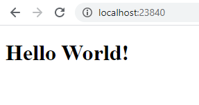

`Task E  Google Drive Manager (https://app.box.com/s/v630vfb7mqk5nqeok68wldyer2iudz2f)`

Description:
  Develop a web service google-drive-manager that provides basic operations to manipulate gdrive content.

Remarks:
  We have tight time constraints for this task, so the main priority is to make it as quick as possible 
  sacrificing the quality and code readability, especially for the initial MR.
  

`Screenshots work app:`

---

